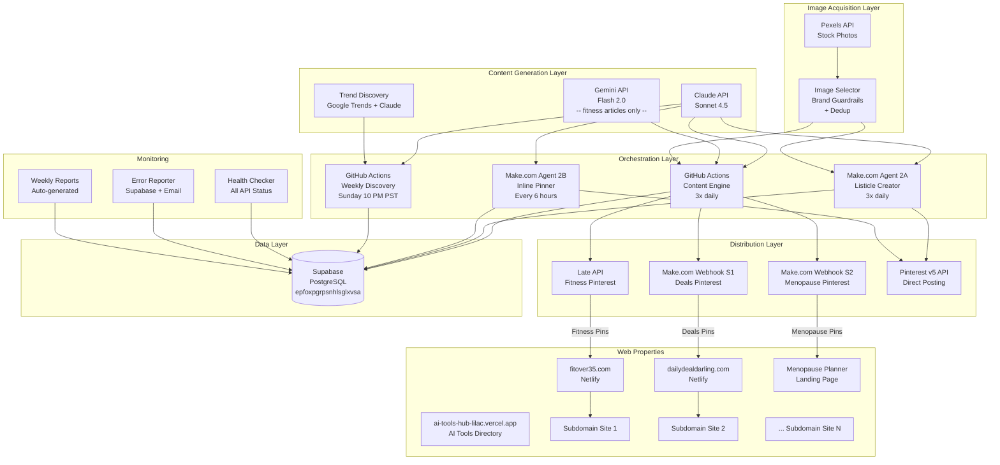
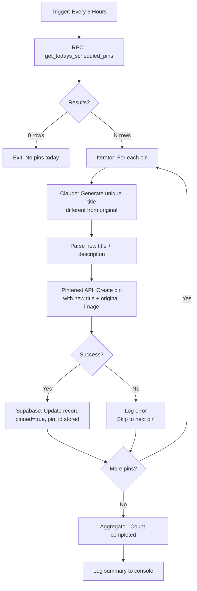
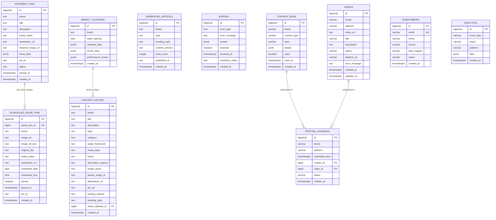
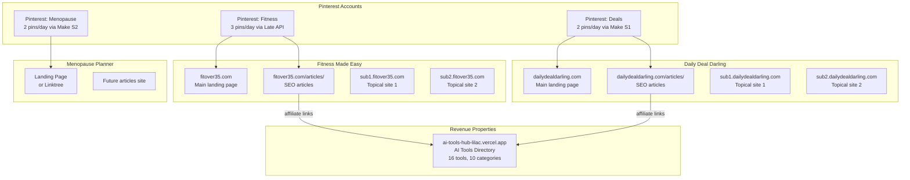

# System Architecture -- Pinterest Empire

Complete technical architecture documentation for the automated Pinterest content creation and distribution system.

---

## Table of Contents

1. [Overall System Architecture](#overall-system-architecture)
2. [Content Creation Pipeline](#content-creation-pipeline)
3. [Scheduled Pinning Pipeline](#scheduled-pinning-pipeline)
4. [Data Model](#data-model)
5. [Subdomain Structure](#subdomain-structure)
6. [Technology Stack](#technology-stack)
7. [API Dependencies and Rate Limits](#api-dependencies-and-rate-limits)
8. [Cost Structure](#cost-structure)
9. [Scaling Considerations](#scaling-considerations)
10. [Security](#security)

---

## Overall System Architecture

The system consists of five primary layers: content generation, image acquisition, posting/distribution, data persistence, and web properties. Two parallel automation engines drive the pipeline: GitHub Actions (for the Fitness Made Easy brand via Late API) and Make.com scenarios (for Daily Deal Darling and Menopause Planner brands).

### System Diagram



### Component Interaction Summary

| Source | Destination | Data Flow | Frequency |
|--------|------------|-----------|-----------|
| Claude API | GitHub Actions | Pin content (title, description, image query) | 3x/day per brand |
| Claude API | Make.com 2A | Listicle content (8 items per post) | 3x/day |
| Claude API | Make.com 2B | Unique pin titles for inline images | ~7 pins/day |
| Claude API | Weekly Discovery | Trend analysis, weekly calendar | Weekly |
| Google Trends | Weekly Discovery | Trending search queries | Weekly |
| Pexels API | GitHub Actions / Make.com | Stock photo URLs | 1 per pin |
| GitHub Actions | Late API | Fitness pins | 3x/day |
| GitHub Actions | Make.com Webhooks | Deals + Menopause pins | 2x/day each |
| Make.com 2A | Pinterest API | Featured image pin | 3x/day |
| Make.com 2B | Pinterest API | Inline image pins | ~7x/day |
| All engines | Supabase | Content tracking, error logging | Every operation |

---

## Content Creation Pipeline

This pipeline runs 3 times daily via the `content-engine.yml` GitHub Actions workflow, and in parallel via Make.com Agent 2A.

### Pipeline Diagram



```mermaid
flowchart LR
    subgraph "Phase 1: Planning"
        A1[Check Weekly Calendar\nfor today's assignments]
        A2{Calendar\nexists?}
        A3[Use calendar assignment\ntopic + board + slug]
        A4[Fall back to\nrandom topic selection]
    end

    subgraph "Phase 2: Content Generation"
        B1[Fetch recent 30 pins\nfrom content_history]
        B2[Select non-repeated:\ntopic, angle, style,\nboard, opener]
        B3[Build Claude prompt\nwith dedup context]
        B4[Claude generates:\ntitle, description,\nimage query, overlay]
        B5[Parse JSON response\n+ add metadata]
    end

    subgraph "Phase 3: Image Acquisition"
        C1[Validate query against\nbrand guardrails]
        C2[Fetch 40 portrait\nimages from Pexels]
        C3[Filter out recently\nused image IDs]
        C4[Select random from\ntop 10 unused]
        C5{Images\nfound?}
        C6[Broaden query\n+ retry]
        C7[Use fallback query]
    end

    subgraph "Phase 4: Publishing"
        D1[Build destination URL\nwith UTM parameters]
        D2{Brand?}
        D3[Late API\nPOST /posts]
        D4[Make.com Webhook S1\nDeals payload]
        D5[Make.com Webhook S2\nMenopause payload]
    end

    subgraph "Phase 5: Tracking"
        E1[Log to content_history\ntable in Supabase]
        E2[Log errors if any\nto errors table]
    end

    A1 --> A2
    A2 -- Yes --> A3
    A2 -- No --> A4
    A3 --> B1
    A4 --> B1
    B1 --> B2 --> B3 --> B4 --> B5
    B5 --> C1 --> C2 --> C3 --> C4 --> C5
    C5 -- Yes --> D1
    C5 -- No --> C6 --> C5
    C6 -- Still no --> C7 --> D1
    D1 --> D2
    D2 -- fitness --> D3
    D2 -- deals --> D4
    D2 -- menopause --> D5
    D3 --> E1
    D4 --> E1
    D5 --> E1
    D3 -- Error --> E2
    D4 -- Error --> E2
    D5 -- Error --> E2
```

### Content Generation Details

**Input to Claude prompt:**
- Brand voice and persona (from `BRAND_CONFIGS` in `content_brain.py`)
- Selected topic and category (rotated to avoid repeats)
- Hook framework template (14 frameworks per brand, rotated)
- Description opener style (8 styles, rotated)
- Visual style (5 styles, rotated)
- Target Pinterest board (5-6 boards per brand, rotated)
- 4-5 SEO keywords to include
- List of 10-20 recent titles to avoid

**Output from Claude:**
```json
{
    "title": "Curiosity-gap pin title (under 100 chars)",
    "description": "150-300 char description with SEO keywords and soft CTA",
    "image_search_query": "Specific detailed Pexels search query",
    "text_overlay": "3-8 words for image overlay",
    "alt_text": "Accessible image description"
}
```

**Deduplication Strategy:**
- Topics: not used in last 10-15 pins
- Hook frameworks: not used in last 5-8 pins
- Visual styles: not used in last 4 pins
- Boards: not used in last 3-5 pins
- Description openers: not used in last 5 pins
- Pexels images: not used in last 50 pins (by image ID)
- Titles: explicitly listed in Claude prompt as "do not repeat"

---

## Scheduled Pinning Pipeline

This pipeline runs every 6 hours via Make.com Agent 2B. It processes inline images from listicle posts that were scheduled for future pinning.

### Pipeline Diagram



### Title Regeneration Logic

Each inline image was originally part of a listicle (e.g., "8 Kitchen Gadgets Worth Buying"). When posted as standalone pins, they need unique titles that:

1. Reference the specific item (not the whole listicle)
2. Use a different hook framework than the original
3. Stand alone as an independent pin
4. Still create a curiosity gap

**Example transformation:**
- Original listicle title: "8 Kitchen Gadgets That Actually Get Used Daily"
- Item: Silicone spatula set
- Regenerated title: "The $12 Spatula Set My Cooking-Obsessed Sister Swears By"

---

## Data Model

### Entity Relationship Diagram



### Table Purposes

| Table | Purpose | Write Frequency | Read Frequency |
|-------|---------|----------------|----------------|
| `content_history` | Track every pin for deduplication and analytics | 7x/day | 21x/day (3 reads per write) |
| `pinterest_pins` | Store listicle post data with all items | 3x/day (Agent 2A) | On-demand |
| `scheduled_inline_pins` | Queue for future inline pin posting | 21x/day (7 per listicle) | 4x/day (Agent 2B) |
| `weekly_calendar` | Store weekly content plans | 3x/week (one per brand) | 21x/day (checked each generation) |
| `generated_articles` | Track SEO articles | ~15x/week | On-demand |
| `errors` | Log all automation errors | Variable | Weekly review |
| `videos` | Legacy video tracking (original system) | Low | Low |
| `content_bank` | Static content ideas | Low | On-demand |
| `subscribers` | Email subscriber tracking | Variable | Weekly |
| `analytics` | Event tracking | Variable | Weekly/monthly |

### Database Size Estimates

| Table | Rows/Month | Avg Row Size | Monthly Growth |
|-------|-----------|-------------|----------------|
| content_history | ~210 | ~500 bytes | ~105 KB |
| pinterest_pins | ~90 | ~2 KB | ~180 KB |
| scheduled_inline_pins | ~630 | ~300 bytes | ~189 KB |
| weekly_calendar | ~12 | ~10 KB | ~120 KB |
| generated_articles | ~60 | ~1 KB | ~60 KB |
| errors | ~20-50 | ~500 bytes | ~25 KB |
| **Total monthly growth** | | | **~680 KB** |
| **Annual projection** | | | **~8 MB** |

The Supabase free tier provides 500 MB of database storage, which at this growth rate supports over 50 years of operation before cleanup is needed. However, regular cleanup of old errors and completed inline pins is still recommended.

---

## Subdomain Structure

### Brand Website Architecture



### Subdomain Purpose

Each subdomain serves as a dedicated landing page for a specific topic cluster, providing:
- Focused SEO targeting for long-tail keywords
- Dedicated email capture forms for specific audiences
- Separate affiliate product recommendations relevant to the topic
- UTM-tracked links from Pinterest pins

### Article Generation Flow

Articles are generated weekly by the `weekly-discovery.yml` workflow:

1. Trend discovery identifies 5 trending topics per brand
2. For each topic, `article_generator.py` generates a 1,200-1,800 word article
3. Articles include: email capture CTA, affiliate links, internal links, image placeholders
4. Articles are published to `outputs/{brand}-website/articles/{slug}.md`
5. The weekly calendar assigns pins that link to these articles
6. Each pin's `destination_url` includes UTM parameters linking to the specific article

---

## Technology Stack

### Runtime Environment

| Component | Technology | Version | Notes |
|-----------|-----------|---------|-------|
| Primary language | Python | 3.11 (GitHub Actions) / 3.9 (macOS local) | Use `Optional[str]` not `str \| None` for 3.9 compat |
| Package manager | pip | Latest | `requirements.txt` for dependency management |
| CI/CD | GitHub Actions | v4 | Workflows in `.github/workflows/` |
| Automation | Make.com | Pro plan | 2 scenarios (Agent 2A, Agent 2B) |
| Database | PostgreSQL via Supabase | 15.x | Free tier, PostgREST API |
| Hosting | Netlify | Free tier | Static sites, auto-deploy from git |
| Version control | Git + GitHub | Latest | Main branch for production |

### AI/ML Services

| Service | Model | Purpose |
|---------|-------|---------|
| Anthropic Claude | claude-sonnet-4-5-20250929 | Pin content generation, title creation, trend analysis, calendar building, article generation |
| Google Gemini | gemini-2.0-flash | Fitness article generation (legacy, being migrated to Claude) |

### External APIs

| API | Purpose | Auth Method |
|-----|---------|-------------|
| Pexels | Stock photo sourcing | API key in header |
| Pinterest v5 | Pin creation and management | OAuth2 bearer token |
| Late API | Pinterest posting (Fitness brand) | Bearer token |
| Google Trends (pytrends) | Trending search data | No auth (scraping) |
| Resend | Transactional email | API key |
| ConvertKit | Email marketing | API key |
| Creatomate | Video rendering (legacy) | Bearer token |

### Python Dependencies

Key packages from `requirements.txt`:

| Package | Version | Purpose |
|---------|---------|---------|
| anthropic | >=0.18.0 | Claude API client |
| google-generativeai | >=0.8.0 | Gemini API client |
| supabase | >=2.3.0 | Supabase Python client |
| requests | >=2.31.0 | HTTP requests |
| pytrends | >=4.9.0 | Google Trends scraping |
| resend | >=2.0.0 | Email sending |
| python-dotenv | >=1.0.0 | Environment variable management |
| pydantic | 2.12.5 | Configuration validation |

---

## API Dependencies and Rate Limits

### Rate Limit Matrix

| API | Rate Limit | Current Usage | Headroom | Throttle Strategy |
|-----|-----------|--------------|----------|-------------------|
| Claude (Anthropic) | 60 RPM (Tier 1) | ~30 RPM peak | 50% | 2-sec delay between calls |
| Pexels | 200 req/hour | ~25 req/hour | 87% | Portrait orientation filter reduces wasted calls |
| Pinterest v5 | 300 writes/hour | ~15 writes/hour | 95% | 5-sec delay between pins |
| Late API | Varies by plan | ~3 req/day | Plenty | No throttling needed |
| Google Trends (pytrends) | Unofficial, ~10 RPM | ~5 RPM (weekly only) | 50% | Only runs weekly |
| Supabase (PostgREST) | 60 connections, 500 req/sec | ~50 req/day | 99%+ | No throttling needed |
| Resend | 100/day (free), 100K/mo (pro) | ~10/week | 98% | Weekly reports only |

### Dependency Chain

If one API goes down, here is what breaks and what continues:

| API Down | Direct Impact | Cascade Impact | Mitigation |
|----------|--------------|----------------|------------|
| Claude | No content generation | No new pins posted | Fall back to content_bank table for pre-written content |
| Pexels | No new images | Pins may reuse old images | Fallback query, image cache |
| Pinterest | Pins queue, not posted | No audience reach | Retry on next run; no data loss |
| Supabase | No dedup, no tracking | May produce duplicates | In-memory dedup, post-recovery reconciliation |
| Late API | Fitness pins not posted | Fitness brand only | Switch to Make.com webhook for fitness |
| Google Trends | No trend data | Fallback evergreen topics used | Fallback trends in `trend_discovery.py` |

---

## Cost Structure

### Current Monthly Costs (Free/Minimal Tier)

| Service | Plan | Monthly Cost | Included |
|---------|------|-------------|----------|
| Supabase | Free | $0 | 500 MB DB, 1 GB bandwidth, 50K auth requests |
| Netlify | Free | $0 | 100 GB bandwidth, 300 build minutes |
| GitHub Actions | Free (public) | $0 | 2,000 minutes/month |
| Pexels | Free | $0 | 200 req/hour |
| Claude (Anthropic) | Pay-as-you-go | ~$3-5 | ~500K-1M tokens/month |
| Make.com | Pro ($9) | $9 | 10K operations/month |
| Late API | Free/Basic | $0-10 | Varies by plan |
| Resend | Free | $0 | 100 emails/day |
| **Total** | | **~$12-24/month** | |

### Cost Scaling Projection

| Scale | Pins/Day | Claude Cost | Make.com | Total |
|-------|----------|------------|----------|-------|
| Current (3 brands) | 7 | ~$4/mo | $9/mo | ~$15/mo |
| +2 brands (5 total) | 12 | ~$7/mo | $9/mo | ~$18/mo |
| +5 brands (8 total) | 20 | ~$12/mo | $16/mo (Team plan) | ~$30/mo |
| High volume (15 brands) | 40 | ~$25/mo | $29/mo (Teams) | ~$60/mo |

### Revenue Potential

| Revenue Stream | Current Status | Monthly Estimate |
|---------------|---------------|-----------------|
| Pinterest affiliate clicks | Active (being set up) | $0-50 |
| ToolPilot affiliate commissions | Live, pending affiliate approvals | $0-100 |
| Website ad revenue (Mediavine/Ezoic) | Requires 10K-50K sessions/mo | $0 (future) |
| Email affiliate promotions | Subscriber base building | $0 (future) |
| Digital product sales (planners) | Planned | $0 (future) |

---

## Scaling Considerations

### Current Bottlenecks

1. **Make.com operations**: Pro plan allows 10K operations/month. Each Agent 2A run uses ~15 operations. At 3 runs/day = ~1,350 ops/month. Headroom for ~7x growth before upgrading.

2. **Claude API**: Pay-per-token with no hard ceiling. Cost scales linearly with pin volume. At current rates, each pin costs ~$0.02 in Claude API calls.

3. **Pexels rate limit**: 200 req/hour. At current volume (25 req/hour), there is 8x headroom. However, concurrent Make.com + GitHub Actions requests could spike.

4. **Supabase free tier**: 500 MB database, 60 connections. Database growth is minimal (~8 MB/year). Connection pool could be an issue with many concurrent automation runs.

### Scaling Strategies

**Horizontal scaling (more brands):**
- Each brand is independent -- adding a new brand means:
  1. Add brand config to `content_brain.py`
  2. Add niche config to `trend_discovery.py`
  3. Create new Make.com webhook or add to existing scenarios
  4. Create new Pinterest account and boards
  5. Create new subdomain site on Netlify
- No changes needed to core infrastructure

**Vertical scaling (more pins per brand):**
- Increase Make.com schedule frequency
- Add more time slots to GitHub Actions cron
- Monitor rate limits closely
- Consider batching Pexels requests

**If Supabase free tier is outgrown:**
- Upgrade to Pro ($25/mo) for 8 GB DB, 100K auth requests, daily backups
- Or migrate to self-hosted PostgreSQL (~$5/mo on Railway or Fly.io)

**If Make.com Pro plan is outgrown:**
- Upgrade to Teams plan ($29/mo) for 50K operations
- Or migrate posting logic to GitHub Actions (already partially implemented)
- Or build a custom webhook server on Railway/Fly.io

**If Pinterest rate limits are hit:**
- Spread pins across more time slots (hourly instead of 3x daily)
- Use multiple Pinterest accounts per brand (different boards)
- Implement a queuing system with exponential backoff

---

## Security

### API Key Management

| Secret | Stored In | Access Level |
|--------|----------|-------------|
| ANTHROPIC_API_KEY | GitHub Secrets | GitHub Actions only |
| PEXELS_API_KEY | GitHub Secrets | GitHub Actions only |
| SUPABASE_URL | GitHub Secrets + Make.com | Actions + Make.com |
| SUPABASE_KEY (service_role) | GitHub Secrets + Make.com | Full database access |
| LATE_API_KEY | GitHub Secrets | GitHub Actions only |
| MAKE_WEBHOOK_DEALS | GitHub Secrets | GitHub Actions only |
| MAKE_WEBHOOK_MENOPAUSE | GitHub Secrets | GitHub Actions only |
| Pinterest OAuth tokens | Make.com connections | Make.com scenarios only |
| RESEND_API_KEY | GitHub Secrets | GitHub Actions only |
| CONVERTKIT_API_KEY | GitHub Secrets | GitHub Actions only |
| NETLIFY_API_TOKEN | GitHub Secrets | Deployment workflow only |

### Security Principles

1. **Least privilege**: Each service only has the keys it needs
2. **No secrets in code**: All credentials are in GitHub Secrets or Make.com connections
3. **Service role key**: Used for server-side Supabase access (not the anon key)
4. **Row Level Security**: Enabled on all Supabase tables (with permissive policies for service role)
5. **HTTPS only**: All API calls and web properties use HTTPS
6. **No user authentication**: The system is fully automated with no user-facing login

### Security Headers (Netlify)

Configured in `netlify.toml`:
```toml
[[headers]]
  for = "/*"
  [headers.values]
    X-Frame-Options = "DENY"
    X-Content-Type-Options = "nosniff"
    Referrer-Policy = "strict-origin-when-cross-origin"
```

### Access Control

| Resource | Who Can Access | How |
|----------|---------------|-----|
| GitHub repository | Repository owner | GitHub account |
| GitHub Secrets | Repository owner | GitHub Settings > Secrets |
| Supabase dashboard | Project owner | Supabase account |
| Make.com scenarios | Account owner | Make.com account |
| Pinterest accounts | Account holder | Pinterest login |
| Netlify dashboard | Account owner | Netlify account |
| Claude console | Account owner | Anthropic account |

### Key Rotation Schedule

| Secret | Rotation Frequency | How to Rotate |
|--------|-------------------|---------------|
| ANTHROPIC_API_KEY | Annually or if compromised | Generate new key at console.anthropic.com |
| PEXELS_API_KEY | Annually | Generate new key at pexels.com/api |
| SUPABASE_KEY | Only if compromised | Rotate in Supabase Dashboard > Settings > API |
| Pinterest OAuth | Auto-refreshes | Re-authorize in Make.com if expired |
| LATE_API_KEY | Annually | Generate new key in Late dashboard |
| NETLIFY_API_TOKEN | Annually | Generate new token in Netlify User Settings |
| RESEND_API_KEY | Annually | Generate new key in Resend dashboard |

### Threat Model

| Threat | Likelihood | Impact | Mitigation |
|--------|-----------|--------|------------|
| API key leak in logs | Low | High | Never log full API keys; use `key[:8]...` |
| Supabase data breach | Low | Medium | RLS enabled; service role key restricted to server-side |
| Pinterest account hijack | Low | High | Strong password + 2FA on all accounts |
| Make.com scenario tampering | Low | Medium | Account 2FA; scenario export backups |
| GitHub repository compromise | Low | High | 2FA on GitHub; branch protection on main |
| DDoS on Netlify sites | Very Low | Low | Netlify's built-in DDoS protection |
| Claude API abuse (billing) | Low | Medium | Set spending limits in Anthropic console |
